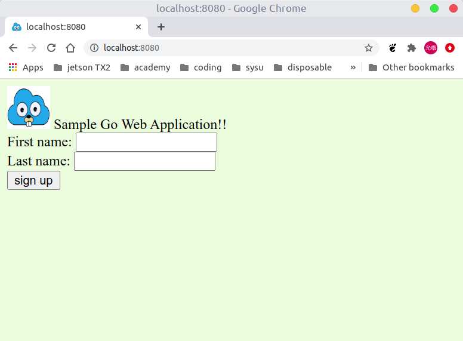
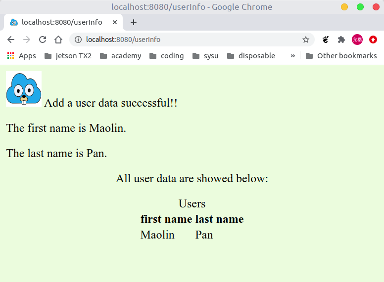
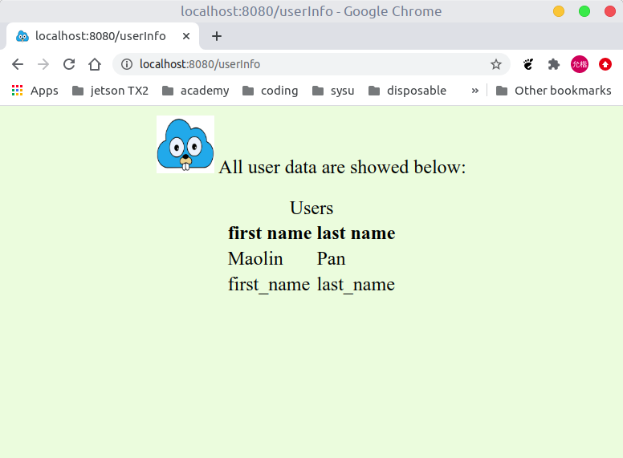
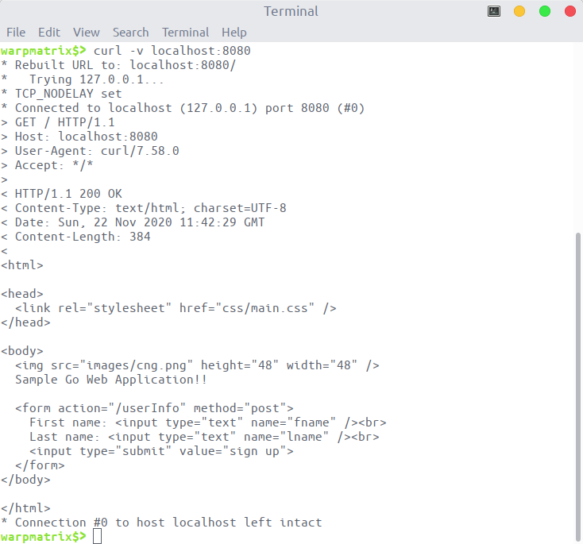
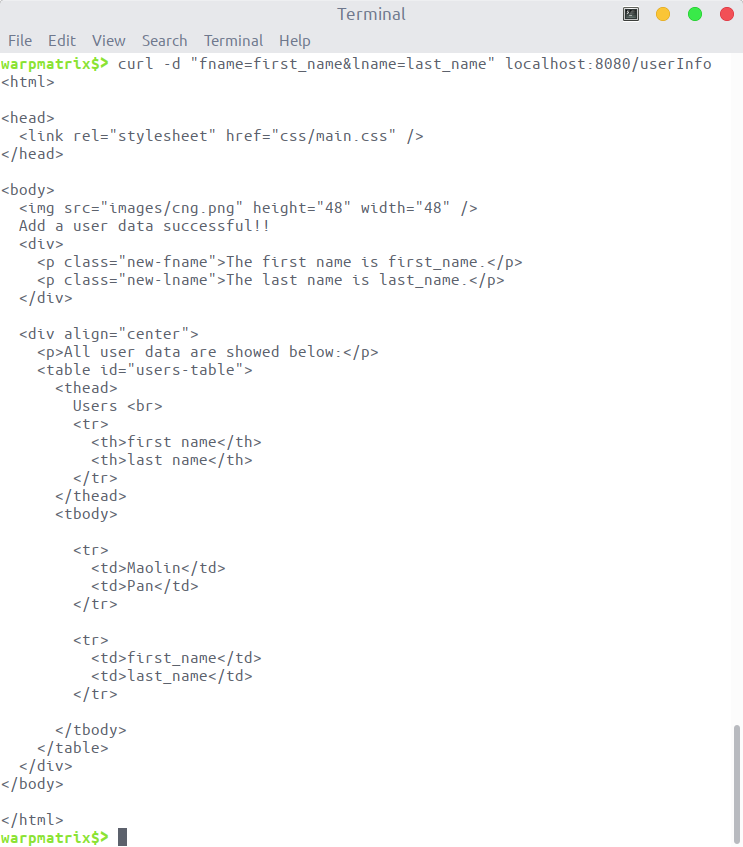
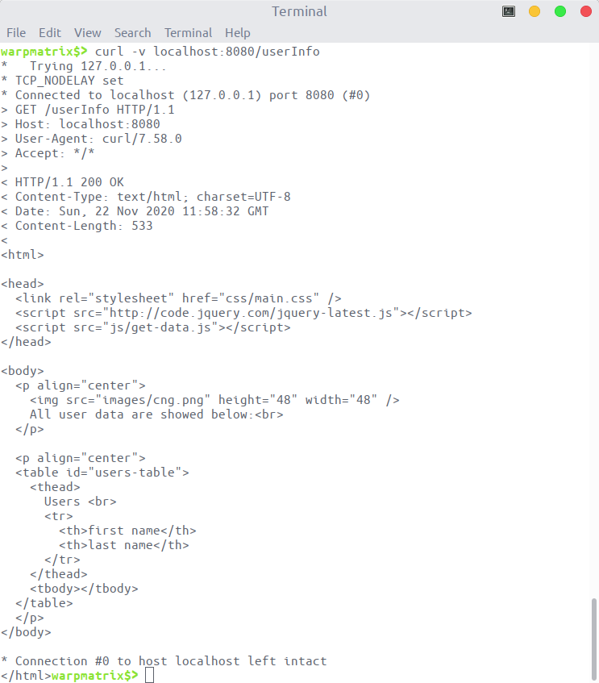
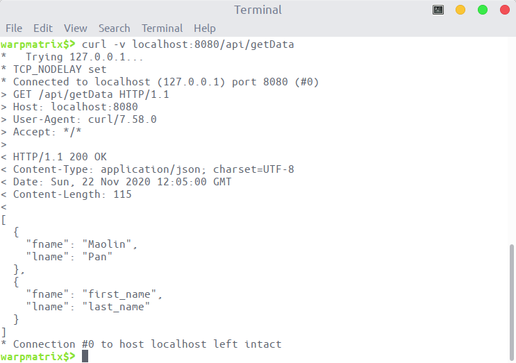
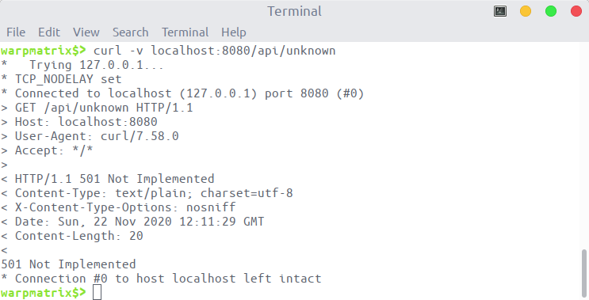
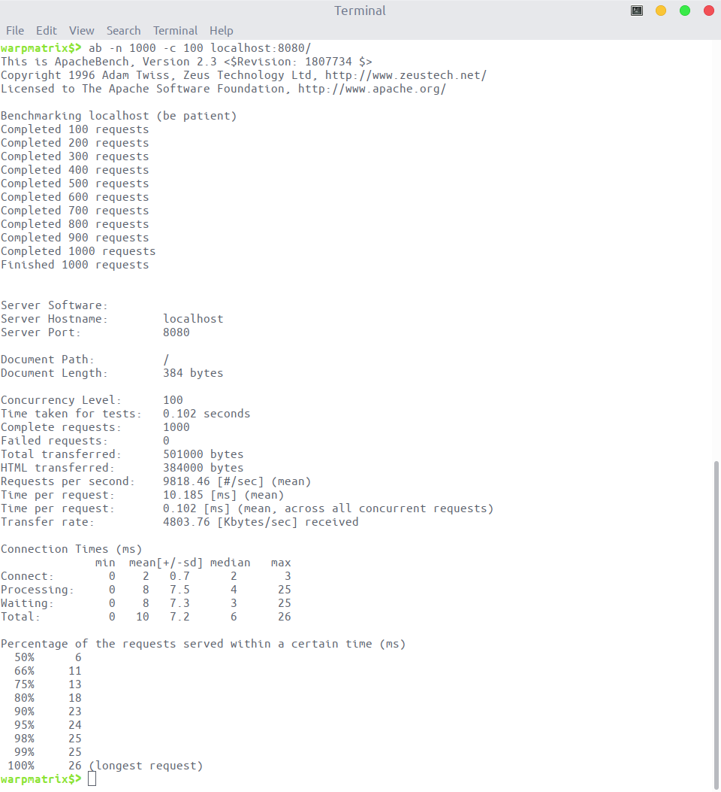

<!-- omit in toc -->
# Cloud-Go

该项目是使用 go 语言开发 web 程序的一个小 demo，记录了 go 语言开发 web 程序的机制。

- 使用的一些主要机制为：多路路由、render、js、模板等。
- 该项目实现的功能比较简单：
  - 用户通过主页可以提交数据，提交数据后可以返回新创建的数据，以及更新后的所有数据。
  - 通过特定的 url，可以显示用户提交的所有数据，也可以通过 json 格式返回所有数据

<!-- omit in toc -->
## Table of Contents

- [1. cloud-go 应用设计](#1-cloud-go-应用设计)
  - [1.1. 支持静态文件服务](#11-支持静态文件服务)
  - [1.2. 支持简单 js 访问](#12-支持简单-js-访问)
  - [1.3. 提交表单并输出表格](#13-提交表单并输出表格)
  - [1.4. `notImplHandler` 的实现](#14-notimplhandler-的实现)
- [2. `curl` 测试](#2-curl-测试)
- [3. `ab` 测试](#3-ab-测试)

## 1. cloud-go 应用设计

该项目的目录结构如下：

```plaintext
./
├── assets （存放静态文件的目录）
├── service （服务器所使用的 go 文件）
|── templates （存放网页显示的 html 模板）
├── main.go
└── README.md
```

执行 `go run main.go` 指令，可以启动服务器。客户端所能进行的操作如下：

- 客户端访问对应地址的 8080 端口即可进入主页。如，本机测试使用的 url 为：`localhost:8080`。得到的效果图如下：

    

- 进入主页后，客户端可以提交数据。提交数据后得到的效果如下：

    

- 客户端可以访问对应地址的 `userInfo` 可以得到所有用户的数据。得到的效果如下所示：

    

除此以外，项目还实现了 `notImplHandler` 等**其它特性**。

### 1.1. 支持静态文件服务

该项目使用模板的方式组织网页的输出。相关模板保存在 `templates` 文件夹下。

模板所需要使用到的静态文件保存在 `assets` 文件下。go 通过官方提供的 `http.FileServer` 接口访问对应的文件系统。整个程序的框架为：先得到项目所在的目录，然后路由时添加存放静态文件的相对目录 `assets`，最终返回所需要的文件。

```go
    // setup file server
    webRoot := os.Getenv("WEBROOT")
    if len(webRoot) == 0 {
        if root, err := os.Getwd(); err != nil {
            panic("Could not retrive working directory")
        } else {
            webRoot = root
        }
    }
    mx.PathPrefix("/").Handler(http.FileServer(http.Dir(webRoot + "/assets/")))
```

### 1.2. 支持简单 js 访问

本项目提供了一些特定的接口，如 `/api/getData`，可以支持 js 访问得到最新的数据。相关的路由设置为：`mx.HandleFunc("/api/getData", getDataHandler(formatter)).Methods("GET")`。

对应的句柄处理器，以 json 的形式返回存储的最新数据。其中，数据存储在 `uList` 变量中：

```go
func getDataHandler(formatter *render.Render) http.HandlerFunc {
    return func(w http.ResponseWriter, req *http.Request) {
        formatter.JSON(w, http.StatusOK, uList)
    }
}
```

html 文件所使用的 js 脚本可以访问该接口，得到相应的数据，再对 html 文件进行改动：将对应的数据写到表格 `tbody` 中。本项目所使用的 js 脚本如下所示：

```js
$(document).ready(function() {
    $.ajax({
        url: "/api/getData"
    }).then(function(data) {
        for (let index = 0; index < data.length; index++) {
            const user = data[index];
            var tblRow = $("<tr></tr>")
            tblRow.append($("<td></td>").text(user.fname))
            tblRow.append($("<td></td>").text(user.lname))
            $("tbody").append(tblRow)
       }
    });
});
```

### 1.3. 提交表单并输出表格

客户端可以在主页输入数据，并按钮提交表单。提交表单后，以 `POST` 方法访问 `/userInfo` 路径。涉及到的路由语句如下：

```go
mx.HandleFunc("/userInfo", postUserInfoHandler(formatter)).Methods("POST")
```

提交数据后，服务器后端检验数据的合法性，并将合法的数据保存到内存当中。随后，将更新后的数据输出到 html 模板中。

```go
func postUserInfoHandler(formatter *render.Render) http.HandlerFunc {
    return func(w http.ResponseWriter, req *http.Request) {
        req.ParseForm()
        if !isValid(req.Form) {
            formatter.JSON(w, http.StatusBadRequest, struct{ ErrorIndo string }{"Bad Input!"})
            return
        }
        newUser := parseUser(req.Form)
        uList = append(uList, newUser)
        formatter.HTML(w, http.StatusOK, "newUser", struct {
            NewUser  user
            UserList []user
        }{NewUser: newUser, UserList: uList})
    }
}
```

输出的时候 html 使用了模板机制。`{{.NewUser.Fname}}` 和 `{{.NewUser.Lname}}` 是新创建数据字段对应的模板。输出内存中最新数据的表格对应的模板为：

```html
<table id="users-table">
    <thead>...</thead>
    <tbody>
        {{range .UserList}}
        <tr>
            <td>{{.Fname}}</td>
            <td>{{.Lname}}</td>
        </tr>
        {{end}}
    </tbody>
</table>
```

整个 html 对应的模板，可以在 [newUser.html](templates/newUser.html) 中查看。

### 1.4. `notImplHandler` 的实现

由于开发进度不足，当访问特定 url 时，可能对应的处理方法尚未发布，此时可以使用 `notImplHandler` 进行占位。例如，下面的例子中，路由器增加了 `/api/unknown` 的路由信息体现实现的 `notImplHandler` 功能。

```go
mx.HandleFunc("/api/unknown", notImplementedHandler()).Methods("GET")
```

具体的实现代码如下：

```go
// notImplemented replies to the request with an HTTP 501 Not Implemented.
func notImplemented(w http.ResponseWriter, r *http.Request) {
    http.Error(w, "501 Not Implemented", http.StatusNotImplemented)
}

// notImplementedHandler returns a simple request handler
// that replies to each request with a ``501 Not Implemented'' reply.
func notImplementedHandler() http.HandlerFunc { return http.HandlerFunc(notImplemented) }
```

使用 `curl` 进行测试可以得到相应的效果图。具体的图片在[curl 测试](#2-curl-测试)中查看。

## 2. `curl` 测试

使用 `curl` 指令进行测试，可以看到实现功能的页面都能正常返回。

使用 `curl` 访问主页的效果如下：



除此以外，`curl` 还可以测试提交表单的功能。可以看到表单提交完成后，能够正常返回页面；并且页面中包含我们刚刚提交的数据。



使用 `curl` 指令访问查询所有数据的页面，效果如下：



使用 `curl` 访问 `/api/getData` 得到最新数据，得到效果如下：



使用 `curl` 访问 `/api/unknown` 得到的效果如下：



## 3. `ab` 测试

执行 `sudo apt install apache2-utils` 指令可以在 ubuntu 下安装 `apache` 的组件，里面包含了压力测试的程序 `ab`。

执行 `ab -n 1000 -c 100 localhost:8080` 可以进行压力测试。使用的参数的具体含义如下：

- -n ：总共的请求执行数，缺省是1
- -c： 并发数，缺省是1

该指令的含义为模拟 100 个用户，对所编写的 web 程序发起总共 1000 次请求。得到的结果如下：



显示的结果，主要参数有：

- `Document Path:          /`（请求的具体文件）
- `Document Length:        384 bytes`（请求的文件index.html大小）
- `Concurrency Level:      100`（并发级别，也就是并发数，请求中－c参数指定的数量）
- `Time taken for tests:   0.102 seconds`（本次测试总共花费的时间）
- `Complete requests:      1000`（本次测试总共发起的请求数量）
- `Failed requests:        0`（失败的请求数量。因网络原因或服务器性能原因，发起的请求并不一定全部成功，通过该数值和 Complete requests相除可以计算请求的失败率，作为测试结果的重要参考。）
- `Total transferred:      501000 bytes`（总共传输的数据量，指的是 ab 从被测服务器接收到的总数据量，包括请求的文本内容和请求头信息。）
- `HTML transferred:       384000 bytes`（从服务器接收到的index.html文件的总大小，等于Document Length ＊ Complete requests）
- `Requests per second:    9818.46 [#/sec](mean)`（平均每秒完成的请求数：QPS，这是一个平均值，等于 Complete requests / Time taken for tests）
- `Time per request:       10.185 [ms](mean)`（从用户角度看，完成一个请求所需要的时间（因用户数量不止一个，服务器完成 100 个请求，平均每个用户才接收到一个完整的返回，所以该值是下一项数值的 10 倍。）
- `Time per request:       0.102 [ms] (mean, across all concurrent requests)`（ 服务器完成一个请求的时间。）
- `Transfer rate:          803.76 [Kbytes/sec] received`（网络传输速度。对于大文件的请求测试，这个值很容易成为系统瓶颈所在。要确定该值是不是瓶颈，需要了解客户端和被测服务器之间的网络情况，包括网络带宽和网卡速度等信息。）

- Connection Times (ms)
  - Connect
  - Processing
  - Waiting
  - Total

    这几行组成的表格主要是针对响应时间也就是第一个 Time per request 进行细分和统计。一个请求的响应时间可以分成网络链接（Connect），系统处理（Processing）和等待（Waiting）三个部分。表的一行分别表示最小值、均值、标准差、中位数和最大值。

    需要注意的是表中的Total并不等于前三行数据相加，因为前三行的数据并不是在同一个请求中采集到的，可能某个请求的网络延迟最短，但是系统处理时间又是最长的呢。所以Total是从整个请求所需要的时间的角度来统计的。这里可以看到最慢的一个请求花费了 26ms，这个数据可以在下面的表中得到验证。

- Percentage of the requests served within a certain time (ms)

    这个表对应的是处理请求时间的百分位数，a% 的请求能够在 t 时间内处理完毕。

    可以看到表中最后一行的数据是时间最长的那个请求（longest request）。响应时间最长为 26ms，那么显然所有请求（100%）的时间都是小于等于 26毫秒的。
